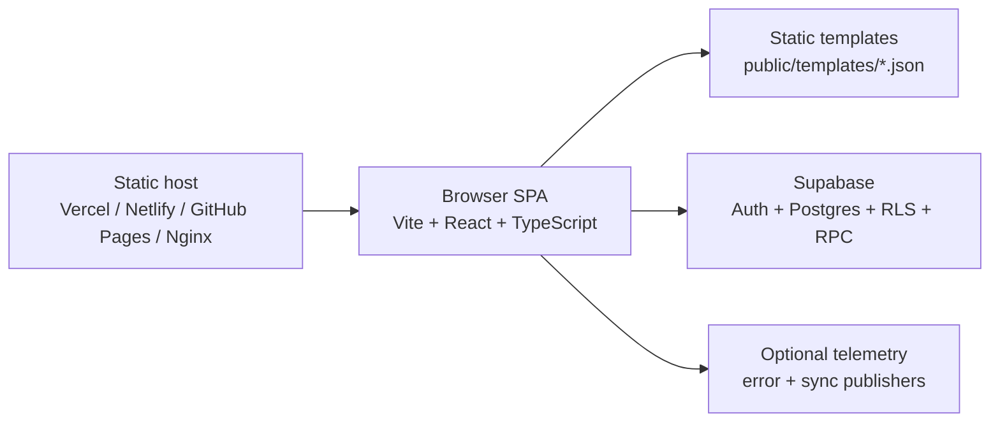
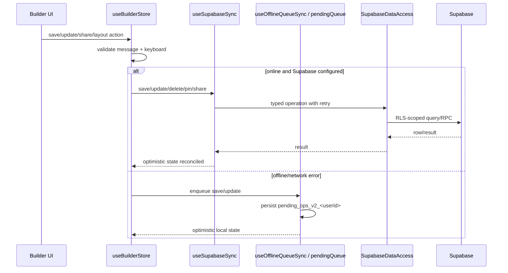

# Architecture

Telegram UI Builder is a static SPA with an optional Supabase persistence layer. The browser owns the editing experience; Supabase stores authenticated user screens, pins, layout positions, and public share tokens. There is no long-running application server in this repository.

## System Shape

The build output is `dist/`. Static hosts must rewrite SPA routes back to `index.html`, especially `/auth` and `/share/:token`.

## Runtime Boot

- `src/main.tsx` initializes sync telemetry defaults, error reporting, runtime config validation, and then renders either `RuntimeConfigError` or `App`.
- `src/lib/runtimeConfig.ts` reads `VITE_SUPABASE_URL` and `VITE_SUPABASE_PUBLISHABLE_KEY`, provides dev/test fallbacks, and blocks production rendering on dangerous config such as localhost Supabase URLs or service-role keys exposed to the client.
- `src/App.tsx` mounts `BrowserRouter`, routes, global toast providers, `ErrorBoundary`, and the draggable GitHub badge. `BrowserRouter` derives its basename from `import.meta.env.BASE_URL`, which is required for GitHub Pages base-path deployment.

## Route Map

| Route | Component | Purpose |
| --- | --- | --- |
| `/` | `src/pages/Index.tsx` | Main builder workbench |
| `/auth` | `src/pages/Auth.tsx` | Supabase email/password login and sign-up |
| `/share/:token` | `src/pages/Share.tsx` | Public entry-screen preview loaded by share token |
| `*` | `src/pages/NotFound.tsx` | 404 fallback inside the SPA |

## Workbench Composition

`src/components/TelegramChatWithDB.tsx` is now a thin compatibility wrapper around `BuilderRoot`.

`BuilderRoot` mounts:

- `BuilderProvider`: creates the single `useBuilderStore()` instance and exposes sliced context values to UI containers.
- `WorkbenchLayout`: resizable desktop shell with status badges for online/offline, pending queue count, and unsaved state.
- `LeftPanelContainer`, `CenterCanvasContainer`, `RightPanelContainer`, `BottomPanelContainer`: presentation wiring only.
- `BuilderDialogs`: import, rename, circular-reference, template, and button-edit dialogs.

Maintenance rule: UI components should receive behavior through the provider/container props. Do not add direct Supabase writes, localStorage queue writes, or share-token side effects inside leaf UI components.

## Core State And Logic

`src/hooks/chat/useBuilderStore.tsx` is the workbench orchestrator. It wires auth, editor state, persistence, offline queue replay, import/export, share links, graph actions, dialogs, onboarding, and shortcuts.

Supporting hooks and libraries:

- `useChatState`: message text/media/parse mode, undo/redo, Telegram-compatible JSON output, template loading, message payload serialization.
- `useKeyboardActions`: inline keyboard mutation helpers and row/button limit enforcement.
- `useScreenNavigation`: current screen, navigation history, local entry-screen selection (`telegram_ui_entry_screen`).
- `referenceChecker`: graph/reference utilities, cycle detection, descendant traversal, safe-delete checks, and relationship graph data.
- `validation`: Zod schemas and Telegram constraints: message content, button text, URL protocol, callback_data byte limit, row/button limits, flow export format, and sensitive public-share guard.
- `useCodegen`: generates starter snippets for `python-telegram-bot`, `aiogram`, and `telegraf` from the current Telegram export payload.

## Persistence Architecture

`src/lib/dataAccess.ts` is the only Supabase CRUD gateway. Keep table names, RPC calls, retry configuration, share-token publish/rotate/revoke, pin writes, and layout writes centralized there.

`src/hooks/chat/useSupabaseSync.ts` owns loaded screens, pins, sync statuses, optimistic updates, retry callbacks, and `SupabaseDataAccess` construction.

`src/lib/pendingQueue.ts` persists offline writes in `localStorage`, dedupes `update` operations per screen id, caps queue size at 100, falls back to memory if storage quota is full, and records failure history. `src/hooks/chat/useOfflineQueueSync.ts` converts queue replay results back into UI state.

## Supabase Data Model

The canonical schema is in `scripts/supabase/schema.sql` and `supabase/migrations/*`.

| Table/RPC | Purpose | Security boundary |
| --- | --- | --- |
| `screens` | Screen name, message payload, keyboard JSON, share flags/token, user owner | RLS owner-only for table access |
| `user_pins` | Per-user pinned screen ids | RLS owner-only |
| `screen_layouts` | Per-user diagram node positions | RLS owner-only |
| `get_public_screen_by_token(token)` | Public share lookup | `SECURITY DEFINER`, explicit columns, no `user_id`, token + `is_public` filter |

Public share reads must use the RPC. Do not reintroduce a broad public SELECT policy on `screens`.

## Public Sharing

Share flow starts from the selected entry screen:

1. `useBuilderStore` verifies an entry screen exists.
2. It rejects dangling `linked_screen_id` references.
3. It rejects sensitive public content using `screenContainsSensitiveData`; the DB also enforces `screens_public_no_sensitive`.
4. It publishes or rotates a cryptographically random token via `SupabaseDataAccess`.
5. It builds a URL with `buildAppUrl("share/<token>")`.
6. `/share/:token` loads the screen via `get_public_screen_by_token` with retry and renders a read-only preview plus "copy into my account" for signed-in users.

## Static Templates

The template library reads `public/templates/library.json` and the listed template JSON files. Templates are static build assets, then validated before being applied to editor state.

## Subpackage

`telegram-callback-factory/` is an independent TypeScript package for generating and parsing Telegram `callback_data`. It has its own `package.json`, `tsconfig.json`, `README.md`, and `npm run build`. It is not currently wired into the main Vite app build, but it shares the project domain and should be maintained as a separate package boundary.

## Extension Rules

- New persistence behavior goes through `SupabaseDataAccess` first, then `useSupabaseSync` or `useOfflineQueueSync`.
- New screen fields require Supabase migration, generated types, `src/types/telegram.ts`, serialization/loading in `useChatState`, validation, import/export docs, and tests.
- New public data exposure requires an explicit RPC or policy review; do not expose owner rows by broad SELECT.
- New localStorage data needs a documented key, versioning/migration plan, and tests.
- New routes need SPA rewrite verification for Vercel, Netlify, GitHub Pages, and server/container deployment.
